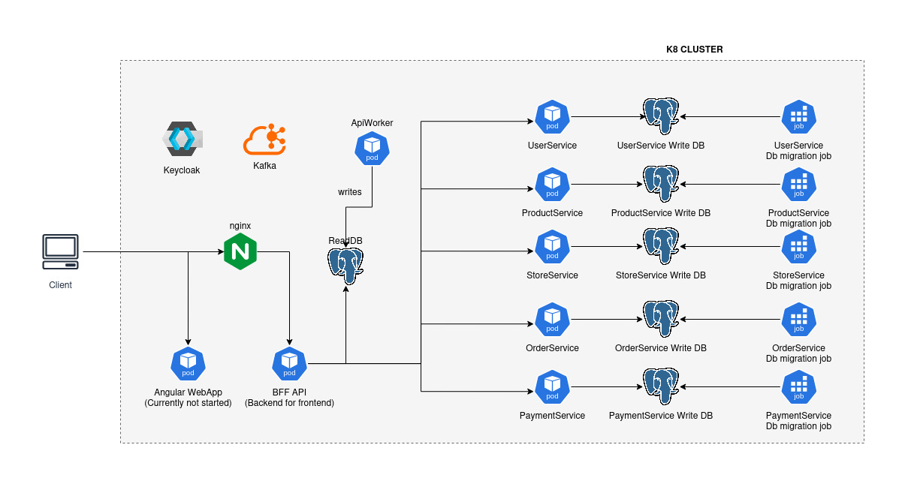
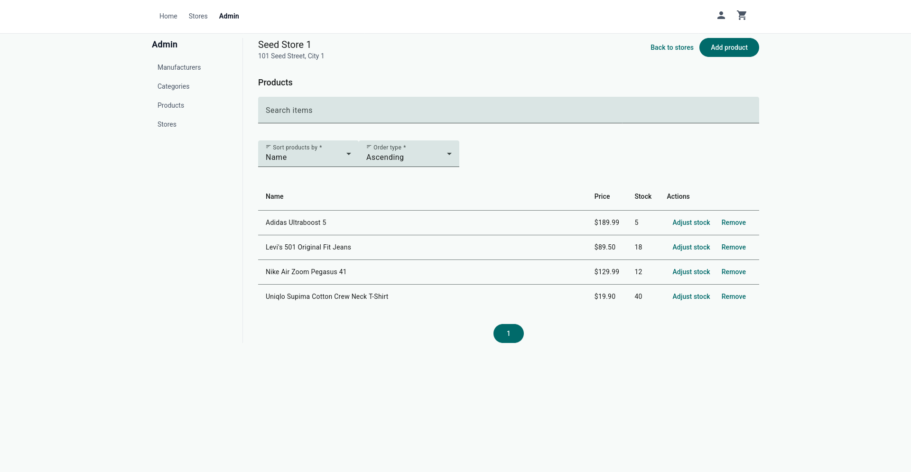
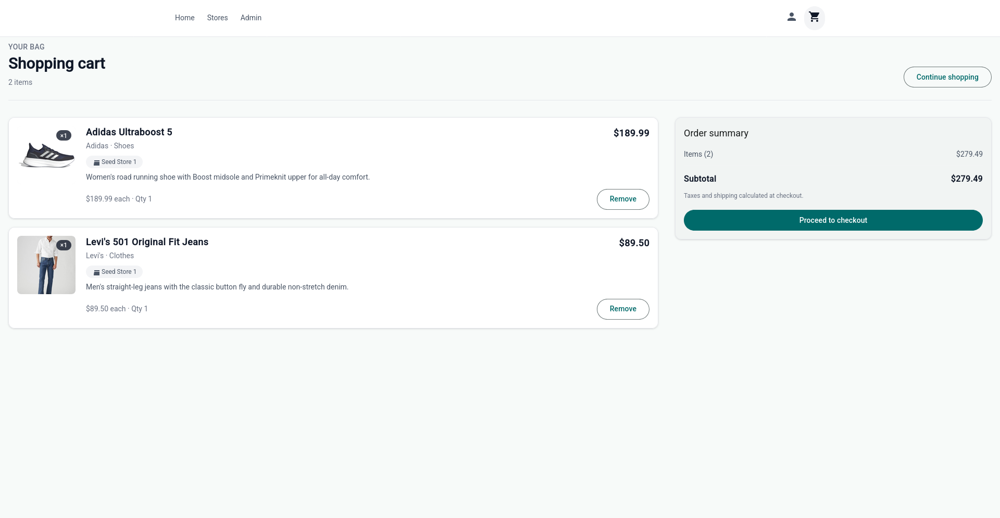
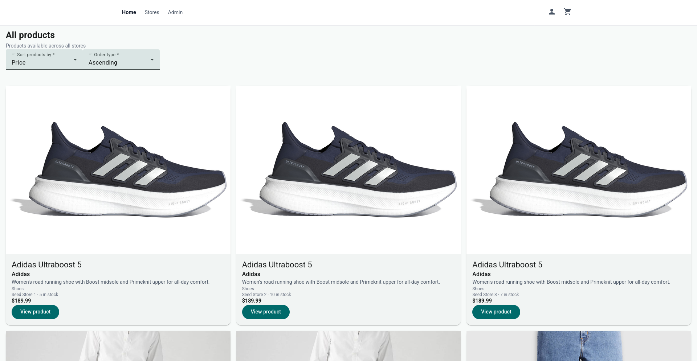
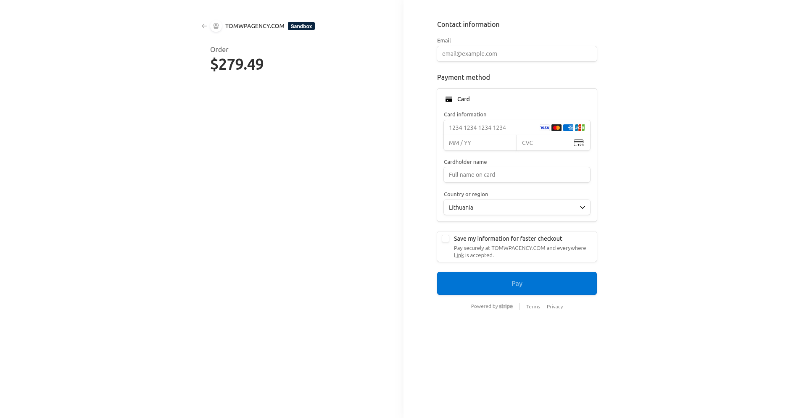

# E-Commerce Store application.

A full-stack e-commerce platform built as a microservice learning project. It demonstrates CQRS with Kafka-backed read-model projection, Keycloak auth, Stripe
checkout, and Docker Compose–based local orchestration.

## Architecture (currently no full K8 implementation, just Docker Compose)



## Frontend

<p float="left">
  
  
  
  
</p>

## Tech stack

- Frontend: Angular + Angular Material.
- Backend: ASP.NET Core(.NET 9).
- Persistence: PostgreSQL, EF Core.
- Containerization & Orchestration: Docker, Docker Compose, Kubernetes (not fully implemented, maybe in the future).
- Automation: Terraform, Bash.
- Event streaming: Kafka.

## Features

- Create, delete, and update store locations.
- Create, delete, and update products, categories, and manufacturers.
- Inventory management.
- User cart + making orders.
- Payment support using Stripe.
- Role-based auth using Keycloak.

## Design

- Built a microservice-based architecture to gain hands-on experience with distributed systems and enterprise application design.
- Implemented reliable payment functionality across distributed services by utilizing the Saga Choreography pattern.
- Implemented the CQRS pattern by separating write and read models, using dedicated write databases per service and a centralized read database. The read model is kept in sync via Kafka events processed by an API worker service. This improves read performance and scalability of PostgreSQL instances, at the cost of eventual consistency between write and read models.
- Containerized the entire system using Docker and set up local development with Docker Compose, alongside an experimental Kubernetes cluster (in progress).
- Integrated authentication and role-based authorization using Keycloak as an identity provider.
- Followed a code-first approach to Designed and implemented a payment system with support for Stripe integration.database design using EF Core.
- Designed a payment system with support for Stripe integration.

## Prerequisites

- Docker + Docker Compose
- Stripe CLI (only if testing checkout)
- LocalStack account and auth token.

## Setup

### Start the app

#### Docker compose:

- Generate .env files:
  ```bash
    cd scripts && ./setup-env.sh
  ```
- Run from the project root directory: <br>
  ```bash
  docker compose up
  ```
- Note: it takes 1-2 minutes to start all services.
- Note: if you are on Windows, it is recommended to run this in WSL.

#### K8 setup (very experimental, not fully implemented)

- Generate .env files:
  ```bash
  cd scripts
  ./setup-env.sh
  ```
- Execute setup-k8-dev.sh (if dotnet installation fails you will have to add dns records to Docker: https://github.com/dotnet/core/issues/8048): <br>
  ```bash
    cd scripts
    ./setup-k8-dev.sh
  ```
- To start and restart deployments manually, do so using Helm from k8s/umbrella directory.

### Setup the stripe webhook listener:

```bash
  stripe listen --forward-to=http://localhost:8080/paymentservice/webhook/stripe
```

### Get the admin access token (for accessing the REST API directly):

- Fetch admin JWT token for development (works only in docker compose): <br>
  ```
  curl -X POST http://localhost:8080/auth/realms/ecommerce-api/protocol/openid-connect/token \
  --data-urlencode client_id=ecommerce-api \
  --data-urlencode client_secret=secret \
  --data-urlencode grant_type=client_credentials
  ```

## Local URLs

| URL                                                  | Service        | Description                                        |
| ---------------------------------------------------- | -------------- | -------------------------------------------------- |
| http://localhost:4200                                | Frontend       | Angular storefront and admin UI                    |
| http://localhost:8080/bff/                           | BFF            | Backend-for-frontend API (used by the Angular app) |
| http://localhost:8080/auth/                          | Keycloak       | Identity provider (via nginx reverse proxy)        |
| http://localhost:9003                                | Keycloak       | Keycloak admin console (`admin` / `admin`)         |
| http://localhost:9000                                | Adminer        | PostgreSQL web UI                                  |
| http://localhost:9001                                | Kafka UI       | Kafka cluster browser                              |
| http://localhost:8080/bff/openapi/v1.json            | BFF            | OpenAPI spec                                       |
| http://localhost:8080/productservice/openapi/v1.json | ProductService | OpenAPI spec                                       |
| http://localhost:8080/storeservice/openapi/v1.json   | StoreService   | OpenAPI spec                                       |
| http://localhost:8080/userservice/openapi/v1.json    | UserService    | OpenAPI spec                                       |
| http://localhost:8080/orderservice/openapi/v1.json   | OrderService   | OpenAPI spec                                       |
| http://localhost:8080/paymentservice/openapi/v1.json | PaymentService | OpenAPI spec                                       |
